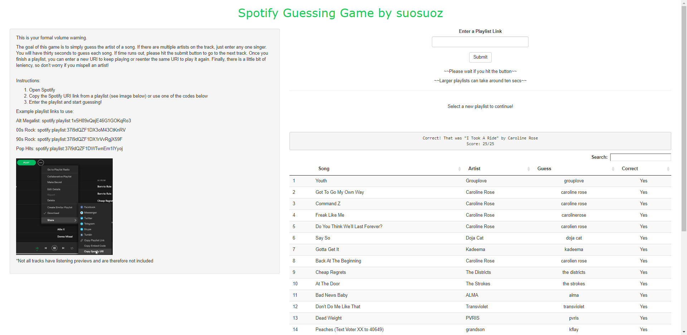

# spotifyguessinggame

I have been listening to Spotify for years now and have enjoyed quizzing myself to see if I knew the artist of the playing song or not. This intrigued me mainly because I have a playlist of over 3000 songs and have wondered if I could really know all the songs in my playlist. This web game automates my game without giving me an opportunity to cheat or peak at the track in Spotify itself. Hope you enjoy! There are three slightly different versions of this game.

# 1 The Finished Game
https://suosuoz.shinyapps.io/spotifyguessinggame/

The live version at the link above allows you enter any Spotify playlist and lets you guess whether or not you know the artist of the randomly selected song. 

# 2 Easier Playlist Control - with a catch

The second version allows you to sign into your Spotify account and get your playlists imported into the app. You can more easily access your tracks, however, it must be downloaded and run in RStudio. The only changes that need to be made are to change the client id and client secret which you can get by signing up with Spotify for Developers and creating an app.

# 3 Live Song Guessing

The third version lets you guess the song live as you are playing it on Spotify. You get to use the entire song and this also times you on how long it takes to enter a result. It also needs to be downloaded and run in RStudio because you need to be active on Spotify and listening to a song.

Connect with me at https://www.linkedin.com/in/mattmatsuo

